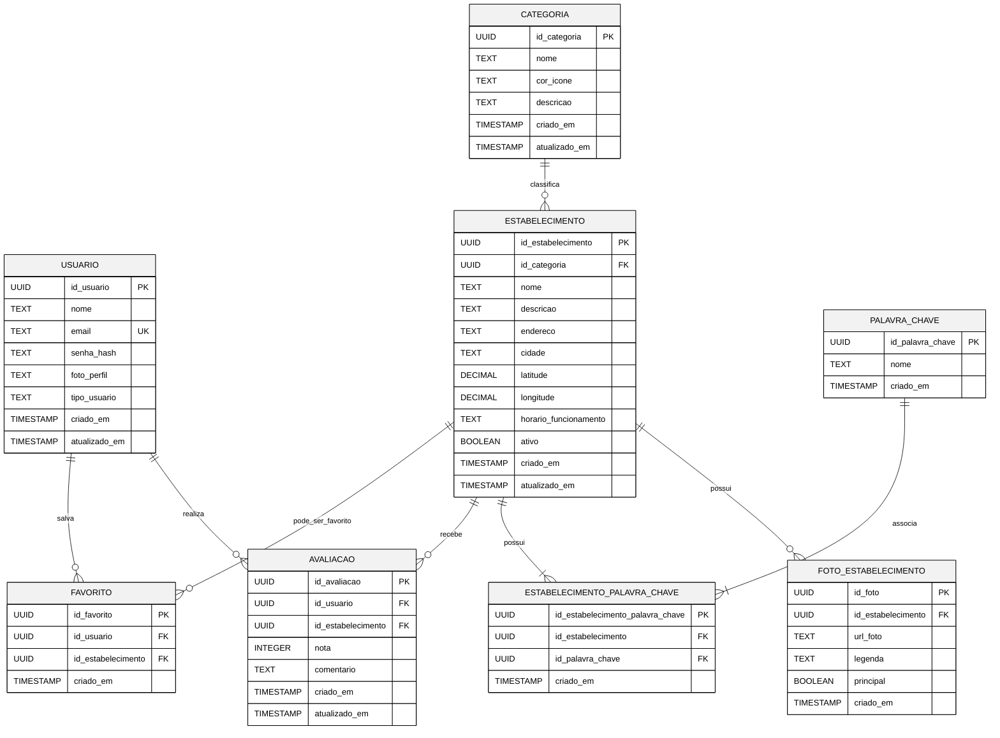

```mermaid
%%{init: {
  "theme": "base",
  "themeVariables": {
    "background": "#ffffff",
    "primaryColor": "#f2f2f2",
    "primaryTextColor": "#000000",
    "primaryBorderColor": "#000000",
    "lineColor": "#000000",
    "secondaryColor": "#e6e6e6",
    "tertiaryColor": "#ffffff"
  }
}}%%

erDiagram

    USUARIO {
        UUID id_usuario PK
        TEXT nome
        TEXT email UK
        TEXT senha_hash
        TEXT foto_perfil
        TEXT tipo_usuario
        TIMESTAMP criado_em
        TIMESTAMP atualizado_em
    }

    CATEGORIA {
        UUID id_categoria PK
        TEXT nome
        TEXT cor_icone
        TEXT descricao
        TIMESTAMP criado_em
        TIMESTAMP atualizado_em
    }

    ESTABELECIMENTO {
        UUID id_estabelecimento PK
        UUID id_categoria FK
        TEXT nome
        TEXT descricao
        TEXT endereco
        TEXT cidade
        DECIMAL latitude
        DECIMAL longitude
        TEXT horario_funcionamento
        BOOLEAN ativo
        TIMESTAMP criado_em
        TIMESTAMP atualizado_em
    }

    FOTO_ESTABELECIMENTO {
        UUID id_foto PK
        UUID id_estabelecimento FK
        TEXT url_foto
        TEXT legenda
        BOOLEAN principal
        TIMESTAMP criado_em
    }

    PALAVRA_CHAVE {
        UUID id_palavra_chave PK
        TEXT nome
        TIMESTAMP criado_em
    }

    ESTABELECIMENTO_PALAVRA_CHAVE {
        UUID id_estabelecimento_palavra_chave PK
        UUID id_estabelecimento FK
        UUID id_palavra_chave FK
        TIMESTAMP criado_em
    }

    AVALIACAO {
        UUID id_avaliacao PK
        UUID id_usuario FK
        UUID id_estabelecimento FK
        INTEGER nota
        TEXT comentario
        TIMESTAMP criado_em
        TIMESTAMP atualizado_em
    }

    FAVORITO {
        UUID id_favorito PK
        UUID id_usuario FK
        UUID id_estabelecimento FK
        TIMESTAMP criado_em
    }

    CATEGORIA ||--o{ ESTABELECIMENTO : classifica
    ESTABELECIMENTO ||--o{ FOTO_ESTABELECIMENTO : possui
    ESTABELECIMENTO ||--|{ ESTABELECIMENTO_PALAVRA_CHAVE : possui
    PALAVRA_CHAVE ||--|{ ESTABELECIMENTO_PALAVRA_CHAVE : associa
    USUARIO ||--o{ AVALIACAO : realiza
    ESTABELECIMENTO ||--o{ AVALIACAO : recebe
    USUARIO ||--o{ FAVORITO : salva
    ESTABELECIMENTO ||--o{ FAVORITO : pode_ser_favorito
```
