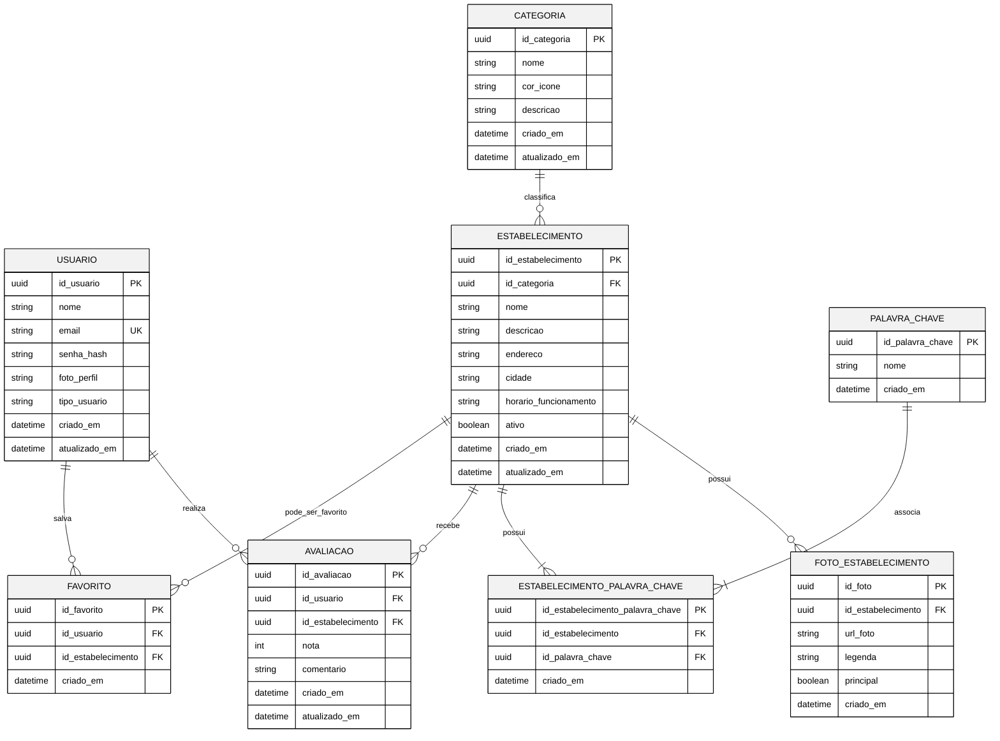

```mermaid
%%{init: {
  "theme": "base",
  "themeVariables": {
    "background": "#ffffff",
    "primaryColor": "#f2f2f2",
    "primaryTextColor": "#000000",
    "primaryBorderColor": "#000000",
    "lineColor": "#000000",
    "secondaryColor": "#e6e6e6",
    "tertiaryColor": "#ffffff"
  }
}}%%

erDiagram

    USUARIO {
        uuid id_usuario PK
        string nome
        string email UK
        string senha_hash
        string foto_perfil
        string tipo_usuario
        datetime criado_em
        datetime atualizado_em
    }

    CATEGORIA {
        uuid id_categoria PK
        string nome
        string cor_icone
        string descricao
        datetime criado_em
        datetime atualizado_em
    }

    ESTABELECIMENTO {
        uuid id_estabelecimento PK
        uuid id_categoria FK
        string nome
        string descricao
        string endereco
        string cidade
        string horario_funcionamento
        boolean ativo
        datetime criado_em
        datetime atualizado_em
    }

    FOTO_ESTABELECIMENTO {
        uuid id_foto PK
        uuid id_estabelecimento FK
        string url_foto
        string legenda
        boolean principal
        datetime criado_em
    }

    PALAVRA_CHAVE {
        uuid id_palavra_chave PK
        string nome
        datetime criado_em
    }

    ESTABELECIMENTO_PALAVRA_CHAVE {
        uuid id_estabelecimento_palavra_chave PK
        uuid id_estabelecimento FK
        uuid id_palavra_chave FK
        datetime criado_em
    }

    AVALIACAO {
        uuid id_avaliacao PK
        uuid id_usuario FK
        uuid id_estabelecimento FK
        int nota
        string comentario
        datetime criado_em
        datetime atualizado_em
    }

    FAVORITO {
        uuid id_favorito PK
        uuid id_usuario FK
        uuid id_estabelecimento FK
        datetime criado_em
    }

    CATEGORIA ||--o{ ESTABELECIMENTO : classifica
    ESTABELECIMENTO ||--o{ FOTO_ESTABELECIMENTO : possui
    ESTABELECIMENTO ||--|{ ESTABELECIMENTO_PALAVRA_CHAVE : possui
    PALAVRA_CHAVE ||--|{ ESTABELECIMENTO_PALAVRA_CHAVE : associa
    USUARIO ||--o{ AVALIACAO : realiza
    ESTABELECIMENTO ||--o{ AVALIACAO : recebe
    USUARIO ||--o{ FAVORITO : salva
    ESTABELECIMENTO ||--o{ FAVORITO : pode_ser_favorito
```
